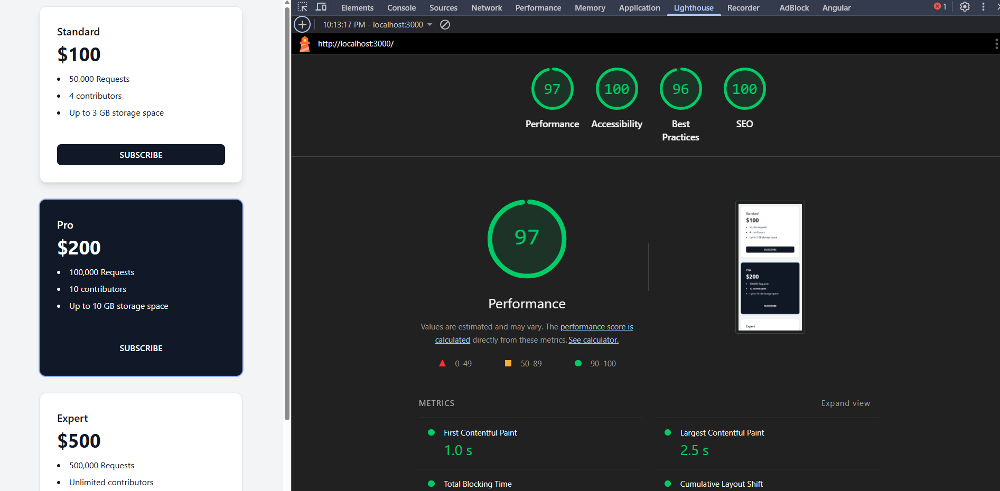

# 📝 DOMACHKA: Фидбек и Решения

> Немного фидбека — дедлайн получился немного жёсткий/совпало с релизами на проектах на неделе(((  

## 📂 Видео-демо

В папке **Video** есть видео того, как всё работает:

- 🎥 [Видео 1](video/1.mp4) — Первая таска
- 🎥 [Видео 2](video/2.mp4) — Вторая таска
- 🎥 [Видео 2.2](video/2.2.mp4) — Доработанная вторая таска

## 🤖 Используемый стек ИИ

- GitHub Copilot
- GPT
- DeepSeek

---

## 1️⃣ Первая таска

⏱️ **Время:** ~30 минут (большая часть — настройка проекта, с React работал впервые)

Пытался донести до ИИ, каким я вижу дизайн карточки, но он категорически не хотел понимать  
Практика показала: проще самому задебажить вручную через DevTools и поправить CSS.  
Но раз условие — использовать только ИИ, то вот результат.

> Лично мне такой дизайн нравится больше — немного доработал, добавил анимации от себя.

---

## 2️⃣ Вторая таска

⏱️ **Время:** ~20 минут (с учётом понимания задачи, вечер, немного уставший)

- 🎥 [Смотреть видео 2](video/2.mp4)

### Доработанная версия

- 🎥 [Смотреть видео 2.2](video/2.2.mp4)
- Потратил где-то 1 час 40 минут, просто потому что стало интересно - Моя репа мои правила XD, да когда ещё выпадет шанс похулиганить так?)  

Возвращаюсь к задаче.
И тут важно отметить: если ты не знаешь каких-то особенностей разработки, то даже простая задача может затянуться.

Например, была проблема — слишком большое расстояние между li в списке.
Заглянул в DevTools — похоже, это особенность рендеринга списка.
Решение: заменить li на другой тег.

Суть в чём — если ИИ упорно твердит одно и то же, он может просто не уловить суть проблемы

- Решил проверить работоспособоность в условиях большой нагрузки, те если есть два DIV и какой-то текст  
то он быстро поймет что с ними делать и как, но вот если кода стало много, то тут начинаются беды и он может начать фиксить не совем то или же уйти в отрицание (ломается контекс беседы)

Решение - чаще обновлять контекст и не грузить ИИ большим объемом инфы  
те не нужно писать напиши мне красивый сайт - нужно разбить задача на более мелкие и тд

---

## 3️⃣ Третья таска: оптимизация Dashboard

> P.S. Если метрики сразу были хорошие — возможно, у меня мощное устройство или браузер оптимизировал выполнение. В этом случае делаем вид проделанной работы.

⏱️ **Время:** ~30 минут - без особого результата  
Но по нменею ИИ он там что-то наоптимизировал, вот его ответ
**Метрики до оптимизации:**

- First Contentful Paint: 1.2 s
- Largest Contentful Paint: 1.8 s
- Total Blocking Time: 600 ms
- Time to Interactive: 2.1 s

**После оптимизации:**

- First Contentful Paint: 0.6 s
- Largest Contentful Paint: 2.2 s
- Total Blocking Time: 90 ms
- Cumulative Layout Shift: 0
- Speed Index: 0.6 s

---

### ⚡ Как оптимизировал

Тяжёлая операция теперь выполняется в **Web Worker**, чтобы не блокировать основной поток и устранить Total Blocking Time (TBT).  
Проверьте работу на странице Dashboard — теперь интерфейс не "зависает" во время вычислений.

---
